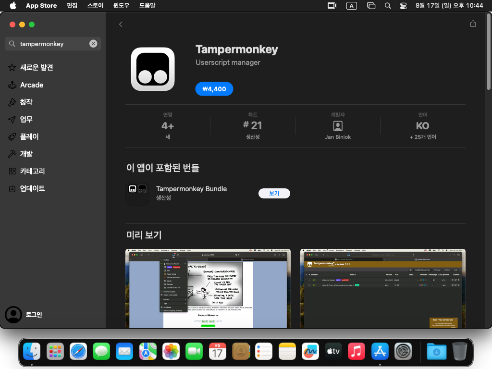
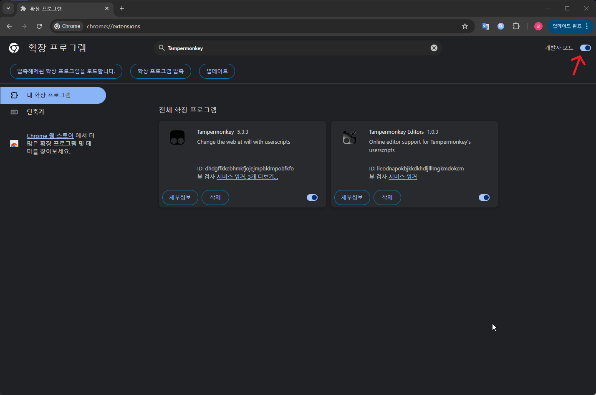
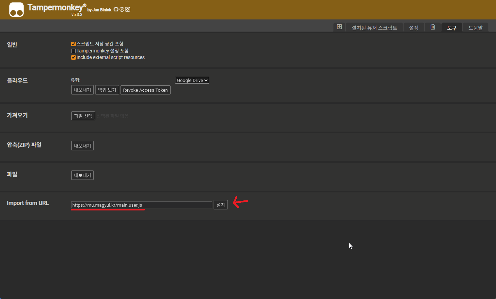

# 🛠️ 미밐 유저 스크립트 관리자

미밐의 불편함을 해결하는 통합 유저 스크립트

---

## 📋 설치 과정

### 1단계: Tampermonkey 확장 프로그램 설치

브라우저에 따라 아래 링크에서 Tampermonkey를 설치하세요:

#### 🌐 Chrome
1. [Chrome 웹 스토어](https://chrome.google.com/webstore/detail/tampermonkey/dhdgffkkebhmkfjojejmpbldmpobfkfo)에 접속
2. **"Chrome에 추가"** 버튼 클릭
3. 확인 팝업에서 **"확장 프로그램 추가"** 클릭
4. 설치 후 확장 프로그램 관리에서 활성화 확인

#### 🦊 Firefox
1. [Firefox Add-ons](https://addons.mozilla.org/en-US/firefox/addon/tampermonkey/)에 접속
2. **"Firefox에 추가"** 버튼 클릭
3. 확인 팝업에서 **"추가"** 클릭
4. 설치 후 부가 기능 관리에서 활성화 확인

#### 🔷 Microsoft Edge
1. [Edge Add-ons](https://microsoftedge.microsoft.com/addons/detail/tampermonkey/iikmkjmpaadaobahmlepeloendndfphd)에 접속
2. **"받기"** 버튼 클릭
3. 확인 팝업에서 **"확장 추가"** 클릭
4. 설치 후 확장 관리에서 활성화 확인

#### 🧭 Safari
> **주의:** Safari용 Tampermonkey는 유료입니다 ($2.99)

1. [App Store](https://apps.apple.com/us/app/tampermonkey/id1482490089)에서 Tampermonkey 앱 구매
2. Safari → 환경설정 → 확장에서 Tampermonkey 활성화

**💰 무료 대안:** [Stay 2](https://apps.apple.com/app/stay-for-safari/id1591620171) 앱을 사용하면 무료로 유저 스크립트를 사용할 수 있습니다.

#### ✅ 설치 확인
Tampermonkey가 정상적으로 설치되면 브라우저 상단 도구 모음에 Tampermonkey 아이콘이 나타납니다.

---

### ⚠️ 중요한 추가 설정

Tampermonkey 설치 후 반드시 아래 설정들을 확인해주세요.  
**특히 Chrome/Edge 사용자는 개발자 모드 활성화가 필수입니다.**

#### ⚙️ 개발자 모드 활성화 (Chrome/Edge 필수)

**Chrome 기반 브라우저에서 Tampermonkey 사용 시 필수 설정입니다.**

1. 브라우저 주소창에 `chrome://extensions` 또는 `edge://extensions` 입력
2. 페이지 우측 상단의 **"개발자 모드"** 토글 버튼 활성화
3. 이 설정은 Manifest V3 업데이트로 인해 userScripts API 사용에 필요합니다

---

### 2단계: 유저 스크립트 설치

#### 📥 방법 1: 직접 다운로드 (추천)
1. **[main.user.js](https://mu.magyul.kr/main.user.js)** 링크를 클릭
2. Tampermonkey 설치 페이지가 자동으로 열립니다
3. **"설치(Install)"** 버튼을 클릭

#### 🔧 방법 2: 대시보드에서 설치
1. Tampermonkey 아이콘 클릭 → **"대시보드"** 선택
2. **"도구"** 탭 클릭
3. **"URL에서 설치"**에 URL 입력: `https://mu.magyul.kr/main.user.js`
4. **"설치"** 버튼 클릭

---

### 3단계: 설치 확인 및 활성화 확인

#### ✅ 설치 확인 방법
1. **Tampermonkey 아이콘**을 클릭
2. **"대시보드"** 선택
3. 설치된 스크립트 목록에서 **"미밐 유저 스크립트 관리자"** 확인

#### 🔄 활성화 상태 확인
스크립트 이름 왼쪽에 표시되는 상태를 확인하세요:
- 🟢 **녹색**: 활성화됨 (정상)
- ⚪️ **회색**: 비활성화됨 (클릭하여 활성화)

#### 🌐 실제 사이트에서 작동 확인
1. **[미밐](https://memic.at)** 사이트 방문
2. Tampermonkey 아이콘에 **숫자 표시**가 나타나면 정상 작동
3. 아이콘을 클릭하여 **"미밐 유저 스크립트 관리자"**가 활성화되어 있는지 확인

---

## 🔧 문제 해결

### ❌ 스크립트가 작동하지 않는 경우

**1. Tampermonkey 확장 프로그램 상태 확인**
- 브라우저 설정 → 확장 프로그램에서 Tampermonkey가 **활성화**되어 있는지 확인
- 확장 프로그램이 비활성화되어 있다면 토글 버튼을 클릭하여 활성화

**2. 개발자 모드 활성화 (Chrome/Edge 필수)**
- Chrome/Edge 브라우저에서는 **개발자 모드**가 반드시 활성화되어 있어야 함
- `chrome://extensions` 또는 `edge://extensions`에서 우측 상단 개발자 모드 토글 확인
- 이는 Manifest V3 업데이트로 인한 필수 요구사항

**3. 스크립트 활성화 상태 확인**
- Tampermonkey 대시보드에서 **"미밐 유저 스크립트 관리자"**가 활성화(녹색 점)되어 있는지 확인
- 비활성화 상태라면 스크립트명을 클릭하여 활성화

**4. 기타 해결 방법**
- **강제 새로고침:** Ctrl+F5 (Windows) 또는 Cmd+Shift+R (Mac)
- **브라우저 재시작:** 브라우저를 완전히 종료 후 다시 실행
- **스크립트 재설치:** 기존 스크립트 삭제 후 다시 설치

### 🔧 개발자 모드 관련 오류

**Chrome 기반 브라우저에서 개발자 모드가 필요한 이유:**
- **Manifest V3 정책:** Google의 새로운 확장 프로그램 정책으로 인해 userScripts API 사용 시 개발자 모드 필수
- **2단계 인증:** userScripts 권한과 개발자 모드 옵션의 이중 보안 체계
- **사용자 보호:** 사용자가 스크립트 실행에 대해 충분히 인지하도록 하기 위한 Google의 의도

**모바일 브라우저에서의 개발자 모드:**
- **Microsoft Edge Android:** 확장 프로그램 페이지에서 개발자 모드 토글 활성화
- **Kiwi Browser:** 확장 프로그램 관리에서 개발자 모드 설정

### 📱 모바일에서 사용하려는 경우

**모바일 브라우저에서는 제한적으로 지원됩니다.**
- **Android:** Kiwi Browser 또는 Firefox + Tampermonkey 사용
- **iOS:** Safari + Stay 2 앱 사용 (Tampermonkey 대안)
- **권장:** 데스크톱 브라우저 사용

### 📞 추가 지원

문제가 계속 발생하면 다음을 확인하세요:
- **브라우저 콘솔:** F12 → Console 탭에서 오류 메시지 확인
- **Tampermonkey 로그:** 대시보드에서 오류 로그 확인
- **브라우저 호환성:** Chrome, Firefox, Edge 최신 버전 권장
- **문의하기:** [https://mu.magyul.kr/issues](https://mu.magyul.kr/issues)

---

## 📊 스크립트 작동 사이트

- 🌐 **memic.at** - 미밐 커뮤니티
- 🌐 **shelter.id** - 미밐 전 쉘터 커뮤니티 (현재는 미밐으로 접속)

---

## 📝 업데이트

스크립트는 자동으로 업데이트됩니다. 수동 업데이트가 필요한 경우:

1. Tampermonkey 대시보드 접속
2. 스크립트 옆 **"마지막 업데이트"** 컬럼의 **"지금 확인"** 클릭

---

## 👥 제작진

- **MaGyul** - 메인 개발자
- **isnoa** - 공동 개발자
- **NoonDaL** - 공동 개발자

## 📄 라이선스

이 프로젝트는 **GPL-3.0** 라이선스 하에 배포됩니다.

## 📞 문의

문제 발생 시 [Issues](https://mu.magyul.kr/issues)에서 문의해주세요.

---

Copyright © 2025 MaGyul. All rights reserved.